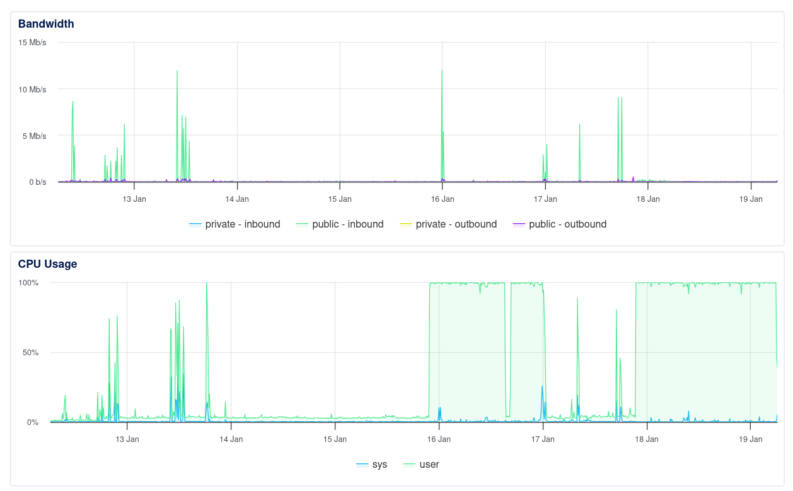

# Incident Report: Umami Container Cryptominer

**Date:** 2026-01-19
**Severity:** Medium
**Status:** Resolved
**Time to Detection:** ~3 days (see monitoring graph below)
**Time to Resolution:** ~15 minutes from detection

## Executive Summary

A cryptominer was discovered running inside the Umami analytics container. The attack exploited an outdated version of Umami (v2.15.1, 13 months old) to gain code execution and deploy mining software. The attack was fully contained within the Docker container with no host compromise.

## Timeline

| Time (UTC) | Event |
|------------|-------|
| 2026-01-16 (approx) | **CPU spikes to 100%** — DigitalOcean monitoring shows sustained load begins |
| 2026-01-18 ~02:20 | First malware binary created (`ClMcAti`) |
| 2026-01-18 ~08:58 | Second binary staged in `/tmp/lrt` |
| 2026-01-19 ~02:41 | Additional binaries created (`75nHeg`, `PKMh`) |
| 2026-01-19 ~10:53 | User notices high CPU in htop, reboots server |
| 2026-01-19 ~10:54 | Investigation begins |
| 2026-01-19 ~10:55 | Malware located in Umami container |
| 2026-01-19 ~10:56 | Malware removed |
| 2026-01-19 ~10:57 | Umami upgraded to v3.0.3 |
| 2026-01-19 ~10:58 | Read-only filesystem applied to container |
| 2026-01-19 ~10:59 | Host verified clean, incident closed |

### Monitoring Evidence



DigitalOcean monitoring shows sustained 100% CPU usage starting around Jan 16, two days before the earliest file timestamp we found. This suggests either:
- Earlier malware binaries were replaced/updated (file timestamps reflect last write)
- The initial payload ran in-memory before dropping persistent files
- Container restart on Jan 17 (brief CPU dip visible) may have triggered re-infection

Bandwidth remained normal throughout, indicating no data exfiltration—purely CPU mining.

## Attack Details

### Malware Found

| File | Location | Size | Created |
|------|----------|------|---------|
| `ClMcAti` | `/app/.next/` | 1.3 MB | Jan 18 02:20 |
| `75nHeg` | `/app/.next/` | 2.6 MB | Jan 19 02:41 |
| `PKMh` | `/app/.next/` | 12 KB | Jan 19 02:41 |
| `lrt` | `/tmp/` | 1.3 MB | Jan 18 08:58 |

All files were ELF executables owned by `nextjs:nogroup`. The naming convention (random alphanumeric strings) and staging in `.next/` (a legitimate Next.js build directory) suggests an attempt to blend in.

### Attack Vector

**Vulnerable Software:** Umami v2.15.1 (released December 2023)
**Current Version:** v3.0.3 (released December 2025)
**Gap:** 13 months of security patches missing

The attacker likely exploited a known vulnerability in Umami to achieve remote code execution within the container. The `nextjs` user (UID 1001) had write access to `/app/.next/` and `/tmp/`, allowing malware persistence across process restarts (but not container restarts).

### Containment Analysis

The attack was **fully contained** within the Docker container:

| Vector | Status | Evidence |
|--------|--------|----------|
| Host filesystem | Clean | No `/app` directory on host |
| SSH keys | Clean | Only authorized key present |
| Systemd services | Clean | No malicious units |
| Crontabs | Clean | Only backup script |
| Other containers | Clean | No cross-container access |
| Network listeners | Clean | Only expected ports (80, 443, 22) |

**Why containment succeeded:**
- Docker process/filesystem isolation
- Umami runs as unprivileged user (`nextjs`, UID 1001)
- No host volumes mounted
- No `--privileged` flag or dangerous capabilities
- Container networking isolated from host

## Remediation Actions

### Immediate (during incident)

1. Removed all malware binaries
2. Upgraded Umami from v2.15.1 to v3.0.3
3. Removed old vulnerable Docker image
4. Verified host integrity

### Preventive (hardening)

1. **Read-only filesystem** - Container now runs with `read_only: true`
2. **Tmpfs for /tmp** - Volatile 64MB RAM disk, cleared on restart
3. **Image pinning** - Pinned to `3.0.3` (manual updates required, but avoids supply chain risk)

### Configuration Changes

```yaml
# docker-compose.prod.yml
umami:
  image: ghcr.io/umami-software/umami:3.0.3
  read_only: true
  tmpfs:
    - /tmp:size=64M
```

## Impact Assessment

| Impact Area | Assessment |
|-------------|------------|
| Data breach | None - attacker had no database access |
| Service disruption | Minimal - brief restart during remediation |
| Financial | CPU cycles consumed for mining (~3 days based on monitoring) |
| Reputation | None - no user-facing impact |

## Lessons Learned

### What went well
- Container isolation worked as designed
- Quick detection once symptoms appeared
- Rapid remediation (~15 minutes)
- No data compromise

### What could improve
- **Monitoring:** No alerting on unusual CPU usage
- **Updates:** Umami was 13 months out of date
- **Hardening:** Read-only filesystem should have been default

## Recommendations

### Short-term
- [x] Update Umami to latest version
- [x] Apply read-only filesystem
- [ ] Set up CPU usage alerting (Umami or external)

### Long-term
- [ ] Establish container update schedule
   - Monthly review using version tracking tool to alert on available updates
- [ ] Consider read-only filesystems for other containers where feasible
- [ ] Document which containers need write access and why

## Appendix: Useful Commands

Commands used during investigation:

```bash
# Find suspicious files in container
docker exec <container> find /app -type f -name '*[A-Z][a-z][A-Z]*'

# Check container processes
docker exec <container> ps aux

# Verify read-only filesystem
docker exec <container> touch /app/test && echo "WRITABLE" || echo "Read-only"

# Check host for persistence
find /etc /root /usr/local -type f -mtime -2
systemctl list-timers --all
cat ~/.ssh/authorized_keys
```

---

*Report prepared: 2026-01-19*
